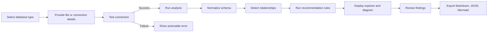
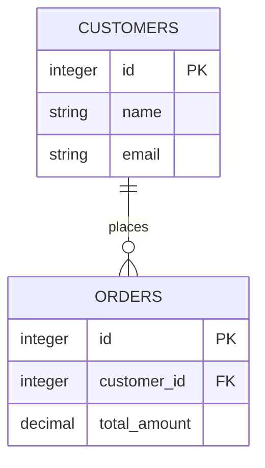
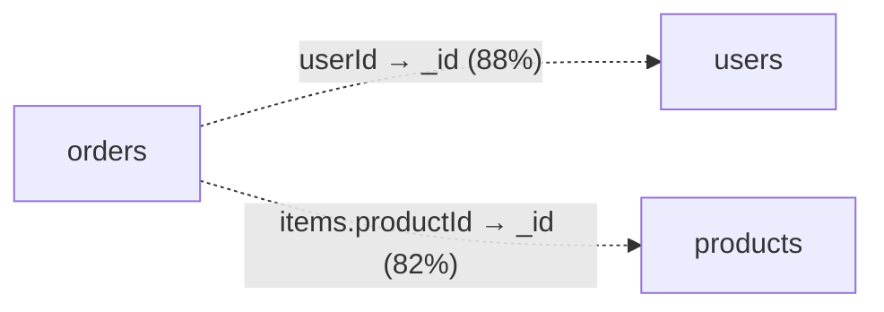
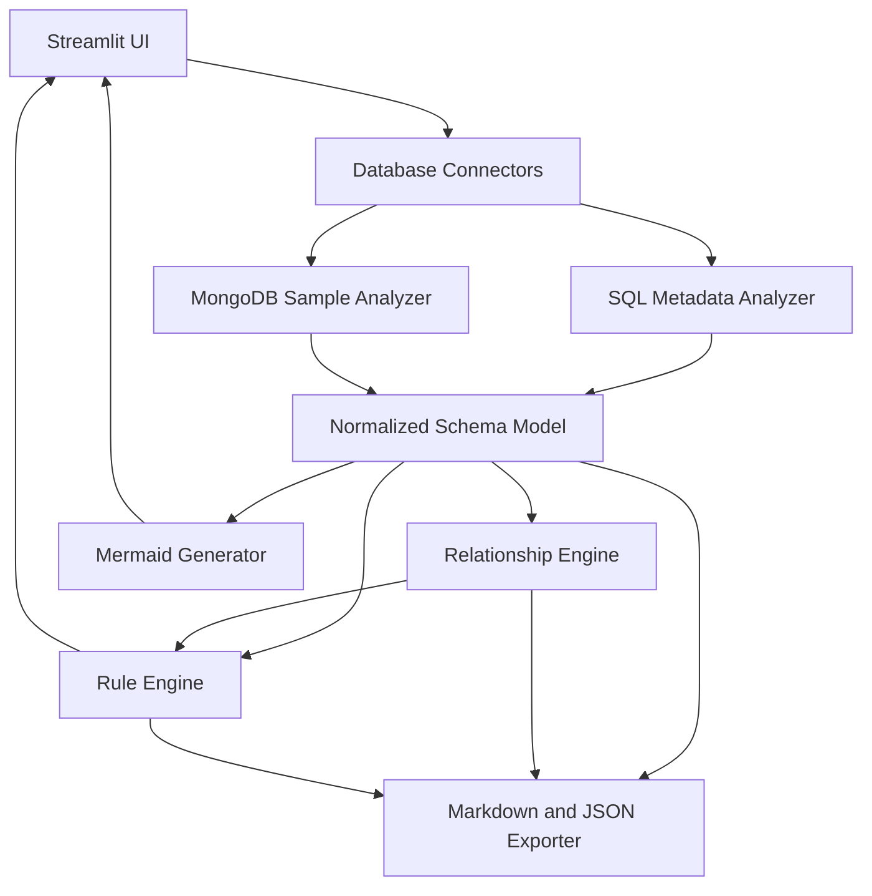

# SchemaScope

## Product Requirements Document

| Field | Value |
|---|---|
| Product | SchemaScope |
| Document version | 1.1 |
| Status | MVP scope locked |
| Prepared for | Prashanth Katakam |
| Date | 26 June 2026 |
| Product type | Local, read-only database analysis tool |
| Primary goal | Build the smallest functional version as quickly as possible |

> **Core product promise:** Connect → Inspect → Visualize → Recommend → Export.  
> SchemaScope never modifies the source database in version 1.

---

## 1. Executive Summary

SchemaScope is a simple local tool that helps users understand the structure of an unfamiliar SQL or MongoDB database.

The user connects a database or uploads a SQLite file. SchemaScope then:

1. Reads schema metadata or a bounded MongoDB document sample.
2. Lists tables, collections, fields, data types, keys, and indexes.
3. Displays confirmed and likely relationships.
4. Generates a Mermaid relationship diagram.
5. Runs a small deterministic recommendation engine.
6. Exports the analysis as Markdown, JSON, and Mermaid source.

The MVP will use Python and Streamlit. It will support SQLite first, then MySQL, followed by MongoDB.

The MVP will not include authentication, cloud deployment, automatic schema changes, migration execution, AI-generated findings, or production performance monitoring.

---

## 2. Problem Statement

Developers, analysts, students, and database learners often receive an existing database without clear documentation.

Understanding it usually requires manually inspecting:

- Tables or collections
- Column and field types
- Primary and foreign keys
- Indexes
- Nested MongoDB structures
- Naming conventions
- Potential references
- Obvious schema quality issues

This is slow and error-prone, especially when:

- Foreign keys are not declared
- MongoDB references are implicit
- The database has inconsistent naming
- Documentation is outdated or missing
- The user does not know the database engine deeply

SchemaScope provides a fast, read-only first assessment without requiring the user to inspect system catalogs manually.

---

## 3. Product Vision

Make an unfamiliar SQL or MongoDB database understandable within minutes.

SchemaScope should act as a lightweight database structure reviewer, not as a database administration platform.

### 3.1 Product principles

1. **Read-only by design**  
   The tool inspects and recommends but never applies changes.

2. **Simple before advanced**  
   The first version prioritizes a complete narrow workflow over many incomplete features.

3. **Evidence before recommendations**  
   Every finding must explain why it was generated.

4. **Confirmed and inferred are different**  
   Declared relationships must never be mixed with guessed relationships.

5. **Deterministic before AI**  
   Version 1 uses transparent rules rather than an LLM.

6. **Bounded analysis**  
   MongoDB sampling and optional SQL value checks must have clear limits.

---

## 4. Product Objectives

### 4.1 Primary objectives

- Let a user inspect a SQLite database with minimal setup.
- Display tables, columns, keys, indexes, and relationships.
- Generate a useful ER diagram from declared SQL relationships.
- Infer possible undeclared relationships with visible confidence and evidence.
- Profile common MongoDB document structures from a limited sample.
- Identify a small set of practical schema issues.
- Export a report that can be reviewed or shared.

### 4.2 Success metrics

| Metric | MVP target |
|---|---|
| Time to first SQLite schema view | Under 60 seconds for a small local database |
| SQLite support | Complete end-to-end workflow |
| MySQL support | Metadata inspection using the same SQL model |
| MongoDB support | Bounded collection profiling |
| SQL metadata coverage | Tables, views, columns, PKs, FKs, indexes, unique constraints |
| MongoDB profile coverage | Fields, occurrence rates, types, nested objects, arrays, indexes |
| Recommendation coverage | At least 5 SQL rules and 5 MongoDB rules |
| Safety | Zero write operations |
| Export | Markdown, JSON, and Mermaid source |
| Explainability | Every inferred relationship and finding shows evidence |

---

## 5. Users

### 5.1 Primary users

- Developers joining an existing project
- Data engineers reviewing an inherited database
- Analysts who need a quick schema overview
- Students learning SQL or MongoDB
- Freelancers assessing a client database
- Technical leads reviewing a database before improvement work

### 5.2 User needs

The primary user wants to answer:

- What entities exist?
- What fields exist in each entity?
- Which fields are keys?
- How are entities connected?
- Which connections are confirmed?
- Which connections are only inferred?
- Are there obvious schema issues?
- What should be reviewed first?
- Can I export the result for documentation?

---

## 6. Core Use Cases

1. Upload a SQLite database and inspect all tables and relationships.
2. Connect to MySQL and generate a schema review report.
3. Connect to MongoDB and understand common collection shapes.
4. Identify foreign-key-like fields without declared constraints.
5. Detect inconsistent data types or naming.
6. Review reference-like MongoDB fields.
7. Generate a draft MongoDB JSON Schema validator.
8. Export findings for discussion before any database changes.

---

## 7. User Stories

| ID | User story | Priority |
|---|---|---|
| US-01 | As a user, I can select SQLite, MySQL, or MongoDB. | Must |
| US-02 | As a user, I can test a connection before analysis. | Must |
| US-03 | As a user, I can upload a SQLite database file. | Must |
| US-04 | As a user, I can see all detected entities and fields. | Must |
| US-05 | As a user, I can see primary keys, foreign keys, unique constraints, and indexes. | Must |
| US-06 | As a user, I can distinguish confirmed relationships from inferred relationships. | Must |
| US-07 | As a user, I can view a Mermaid relationship diagram. | Must |
| US-08 | As a user, I can understand why each recommendation was created. | Must |
| US-09 | As a user, I can filter findings by severity and entity. | Should |
| US-10 | As a user, I can mark a finding accepted or ignored for the current analysis. | Should |
| US-11 | As a user, I can copy a suggested command without executing it. | Must |
| US-12 | As a user, I can export Markdown, JSON, and Mermaid output. | Must |
| US-13 | As a user, I can control MongoDB sample size. | Should |
| US-14 | As a user, I can see clear connection and analysis errors. | Must |

---

## 8. MVP Scope

### 8.1 In scope

#### Supported database sources

- SQLite
- MySQL
- MongoDB

#### SQL inspection

- Tables
- Views
- Columns
- Native data types
- Nullable status
- Default values
- Primary keys
- Foreign keys
- Unique constraints
- Indexes
- Basic estimated row counts where safely available
- Declared relationship diagram
- Optional bounded overlap checks for inferred relationships

#### MongoDB inspection

- Collections
- Existing indexes
- Bounded document sampling
- Field occurrence rates
- Observed field types
- Mixed-type fields
- Nested objects
- Arrays
- Approximate array-size statistics
- Possible ObjectId references
- Draft JSON Schema validator

#### Recommendations

- Small rule-based SQL rule set
- Small rule-based MongoDB rule set
- Severity
- Confidence
- Evidence
- Suggested next step
- Optional generated command as text only

#### Exports

- Markdown report
- JSON analysis result
- Mermaid diagram source

### 8.2 Explicitly out of scope

The following features must not be built in the MVP:

- Automatic schema modification
- Executing migrations
- Creating or dropping indexes
- Updating or deleting data
- Data cleaning
- Data migration
- Authentication
- User management
- Multi-user collaboration
- Cloud deployment
- Credential vaulting
- React frontend
- FastAPI backend
- Docker or Kubernetes
- Microservices
- LLM-generated findings
- Chat interface
- AI agents
- Slow-query monitoring
- Query-plan optimization
- Production observability
- Drag-and-drop diagram editing
- Oracle support
- SQL Server support
- PostgreSQL support in the first release
- Cross-database joins
- Full MongoDB collection scans

### 8.3 MVP boundary rule

A feature belongs in version 1 only when it is required for this flow:

```text
Connect → Inspect → Visualize → Recommend → Export
```

Anything not required for that flow is deferred.

---

## 9. Product Flow



### 9.1 Analysis sequence

1. Validate the selected source.
2. Test database connectivity.
3. Read metadata or bounded samples.
4. Convert source-specific information into a common model.
5. Load confirmed relationships.
6. Run optional relationship inference.
7. Run database-specific recommendation rules.
8. Generate Mermaid source.
9. Display results.
10. Allow export.

---

## 10. User Interface

The application will be one Streamlit page with four tabs:

1. Connect
2. Schema Explorer
3. Diagram
4. Recommendations

A fifth Report Preview tab may be added only if it does not delay the MVP.

---

## 11. Screen 1: Connect

### 11.1 Shared controls

- Database type selector
- Test Connection button
- Analyse Database button
- Clear Analysis button
- Read-only safety notice
- Connection status
- Analysis status
- Error message area

### 11.2 SQLite fields

- File uploader
- Supported extensions:
  - `.db`
  - `.sqlite`
  - `.sqlite3`
- File name
- File size
- Optional database label

### 11.3 MySQL fields

- Host
- Port, default `3306`
- Database name
- Username
- Password
- Optional SSL toggle
- Connection timeout

### 11.4 MongoDB fields

- Connection URI
- Database name
- Sample size:
  - 100
  - 500
  - 1,000
- Include system collections toggle, default off
- Connection timeout

### 11.5 Connection behavior

- Analyse Database remains disabled until the connection test succeeds.
- Passwords and full URIs are masked.
- Credentials remain only in Streamlit session memory.
- Connection errors must be converted into understandable messages.
- The tool must recommend using a read-only database account.
- A connection test must not trigger a full schema analysis.

### 11.6 Connection error states

| Error | User-facing response |
|---|---|
| Invalid SQLite file | The file is not a valid or readable SQLite database. |
| Unsupported extension | Upload a `.db`, `.sqlite`, or `.sqlite3` file. |
| File is locked | Close applications holding an exclusive lock and retry. |
| Authentication failed | Verify the username, password, and permissions. |
| Host unreachable | Verify host, port, network, and VPN access. |
| Database not found | Verify the database name. |
| MongoDB URI invalid | Verify URI format and encoded special characters. |
| Permission denied | Use an account allowed to read schema metadata. |
| Driver missing | Install the required Python driver and restart the application. |
| Timeout | Increase the timeout or verify network access. |

---

## 12. Screen 2: Schema Explorer

### 12.1 Summary cards

Display:

- Database type
- Database name or uploaded file name
- Number of tables or collections
- Number of fields
- Confirmed relationships
- Inferred relationships
- Index count
- Finding count by severity
- MongoDB sample size when applicable

### 12.2 Entity list

The user can:

- Search by table or collection name
- Filter tables, views, or collections
- Select an entity
- Expand or collapse fields
- Sort entities alphabetically
- Show only entities with findings
- Show only entities with relationships

### 12.3 SQL entity details

Display:

- Entity name
- Table or view
- Column name
- Data type
- Nullable
- Default value
- Primary key
- Foreign key target
- Unique
- Indexed
- Index names
- Optional estimated row count

Example:

```text
orders
├── id              INTEGER      PK
├── customer_id     INTEGER      FK → customers.id, Indexed
├── status          VARCHAR(20)
├── total_amount    DECIMAL(12,2)
└── created_at      DATETIME
```

### 12.4 MongoDB collection details

Display:

- Collection name
- Sampled document count
- Existing indexes
- Field path
- Observed types
- Occurrence rate
- Nested depth
- Array indicator
- Average array length
- Maximum sampled array length
- Reference candidate
- Mixed-type indicator

Example:

```text
orders
├── _id                  ObjectId       100%
├── userId               ObjectId        99%   possible → users._id
├── status               string         100%
├── items                array          100%
│   ├── productId        ObjectId        96%
│   ├── quantity         integer        100%
│   └── price            decimal         98%
└── createdAt            date            99%
```

### 12.5 Analysis warnings

Display visible warnings when:

- A SQL view cannot be inspected fully.
- A table cannot be sampled.
- A MongoDB collection contains fewer documents than the selected sample.
- A collection was skipped due to permissions.
- A result is sample-based.
- A relationship is inferred.
- An estimated count may be inaccurate.

---

## 13. Screen 3: Diagram

### 13.1 SQL diagram

Generate Mermaid ER syntax using declared SQL foreign keys.



### 13.2 MongoDB diagram

Generate a Mermaid flowchart.



### 13.3 Diagram rules

- Declared SQL relationships use solid connections.
- Inferred SQL or MongoDB relationships use dashed connections.
- Inferred relationships include confidence.
- Diagram labels must not claim cardinality when it cannot be determined.
- Entity names must be escaped safely for Mermaid.
- The user can copy Mermaid source.
- The user can select specific entities to reduce diagram size.
- Large diagrams show a warning rather than failing silently.

### 13.4 Diagram limits

For the MVP:

- Default full diagram limit: 50 entities.
- Above 50 entities, ask the user to filter entities.
- Mermaid source export may still include all entities.
- No drag-and-drop editing.
- No permanent layout saving.

---

## 14. Screen 4: Recommendations

### 14.1 Summary

Display:

- Critical findings
- High findings
- Medium findings
- Low findings
- Accepted findings
- Ignored findings
- Open findings

The MVP may omit the Critical level if no rule uses it.

### 14.2 Filters

- Severity
- Entity
- Rule ID
- Database type
- Minimum confidence
- Open, Accepted, or Ignored
- Confirmed or inferred relationship findings

### 14.3 Finding card

Every finding contains:

- Rule ID
- Title
- Entity
- Field, when applicable
- Severity
- Confidence
- Finding description
- Evidence
- Impact
- Recommendation
- Suggested verification
- Optional generated command
- Review status

Example:

```text
Rule: SQL-003
Severity: Medium
Confidence: 94%
Entity: orders.customer_id

Finding:
orders.customer_id appears to reference customers.id,
but no foreign key is declared.

Evidence:
- Column names are compatible.
- Data types match.
- customers.id is unique.
- 99.2% of sampled values overlap.

Impact:
Orphaned values may be introduced because referential integrity
is not enforced by the database.

Recommendation:
Review unmatched values and application behavior. Consider adding
a foreign-key constraint after validation and backup.

Suggested command:
ALTER TABLE orders
ADD CONSTRAINT fk_orders_customer
FOREIGN KEY (customer_id)
REFERENCES customers(id);
```

### 14.4 Review actions

- **Accept**: Mark the recommendation as agreed for review purposes.
- **Ignore**: Mark the recommendation as intentionally ignored.
- **Reopen**: Return an accepted or ignored finding to open.
- **Copy command**: Copy plain text only.
- **Copy finding**: Copy a Markdown representation.

These actions must never change the source database.

---

## 15. Functional Requirements

### 15.1 Connection requirements

| ID | Requirement | Priority |
|---|---|---|
| FR-C01 | Support SQLite file upload. | Must |
| FR-C02 | Support MySQL connection details. | Must |
| FR-C03 | Support MongoDB URI and database name. | Must |
| FR-C04 | Test the connection separately from analysis. | Must |
| FR-C05 | Do not persist passwords or complete URIs. | Must |
| FR-C06 | Mask secrets in the interface and logs. | Must |
| FR-C07 | Provide actionable connection errors. | Must |
| FR-C08 | Allow the user to clear credentials and analysis state. | Must |
| FR-C09 | Recommend read-only database accounts. | Must |
| FR-C10 | Use bounded timeouts. | Should |

### 15.2 SQL analysis requirements

| ID | Requirement | Priority |
|---|---|---|
| FR-S01 | List tables. | Must |
| FR-S02 | List views. | Must |
| FR-S03 | Extract columns and native data types. | Must |
| FR-S04 | Extract nullable flags and defaults. | Must |
| FR-S05 | Extract primary keys. | Must |
| FR-S06 | Extract foreign keys and targets. | Must |
| FR-S07 | Extract unique constraints. | Must |
| FR-S08 | Extract indexes and indexed columns. | Must |
| FR-S09 | Generate an ER diagram from declared foreign keys. | Must |
| FR-S10 | Normalize database-specific type names. | Must |
| FR-S11 | Optionally estimate row counts safely. | Could |
| FR-S12 | Optionally perform bounded value-overlap checks. | Should |
| FR-S13 | Skip unsupported metadata without failing the complete analysis. | Must |

### 15.3 MongoDB analysis requirements

| ID | Requirement | Priority |
|---|---|---|
| FR-M01 | List collections. | Must |
| FR-M02 | List collection indexes. | Must |
| FR-M03 | Sample 100 documents per collection by default. | Must |
| FR-M04 | Allow 100, 500, or 1,000 document samples. | Should |
| FR-M05 | Calculate field occurrence rates. | Must |
| FR-M06 | Record observed field types. | Must |
| FR-M07 | Detect mixed field types. | Must |
| FR-M08 | Detect nested objects. | Must |
| FR-M09 | Detect arrays and sampled length statistics. | Must |
| FR-M10 | Identify possible ObjectId references. | Should |
| FR-M11 | Generate a relationship graph. | Must |
| FR-M12 | Generate a draft JSON Schema validator. | Should |
| FR-M13 | Show that findings are sample-based. | Must |
| FR-M14 | Never run a silent full collection scan. | Must |

### 15.4 Relationship requirements

| ID | Requirement | Priority |
|---|---|---|
| FR-R01 | Store source entity and source field. | Must |
| FR-R02 | Store target entity and target field. | Must |
| FR-R03 | Mark relationships as declared or inferred. | Must |
| FR-R04 | Record confidence for inferred relationships. | Must |
| FR-R05 | Record evidence used for inference. | Must |
| FR-R06 | Hide candidates below the configured threshold. | Must |
| FR-R07 | Allow lower-confidence candidates to be optionally shown. | Should |
| FR-R08 | Never describe an inferred relationship as confirmed. | Must |

### 15.5 Recommendation requirements

| ID | Requirement | Priority |
|---|---|---|
| FR-F01 | Every finding has a unique rule ID. | Must |
| FR-F02 | Every finding has severity. | Must |
| FR-F03 | Inferred findings have confidence. | Must |
| FR-F04 | Every finding includes evidence. | Must |
| FR-F05 | Every finding includes a recommendation. | Must |
| FR-F06 | Commands are plain text only. | Must |
| FR-F07 | Findings can be accepted, ignored, or reopened. | Should |
| FR-F08 | Findings can be filtered. | Should |
| FR-F09 | Findings appear in exports with review status. | Must |

### 15.6 Export requirements

| ID | Requirement | Priority |
|---|---|---|
| FR-E01 | Export Markdown report. | Must |
| FR-E02 | Export normalized JSON. | Must |
| FR-E03 | Export Mermaid source. | Must |
| FR-E04 | Exclude credentials and raw sample values. | Must |
| FR-E05 | Include analysis timestamp and source type. | Must |
| FR-E06 | Include sample size and limitations. | Must |
| FR-E07 | Include open and reviewed findings. | Must |
| FR-E08 | Generate files without modifying the source. | Must |

---

## 16. SQL Recommendation Rules

Only the following rules are required for the MVP.

### SQL-001: Missing primary key

**Trigger**

- A physical table has no declared primary key.

**Evidence**

- Table name
- Existing unique constraints
- Candidate unique columns, if detectable

**Severity**

- Medium by default
- High only when the table is referenced by another table

**Recommendation**

Review whether the table has a stable natural key. Consider adding a primary key after verifying uniqueness and application compatibility.

**Do not**

- Automatically select a primary key
- Generate an executable migration without review

---

### SQL-002: Foreign-key column without index

**Trigger**

- A declared foreign-key column is not the first column in a matching index.

**Evidence**

- Foreign-key column
- Referenced table
- Existing indexes

**Severity**

- Low or Medium

**Recommendation**

Review join, update, and delete patterns. Consider adding an index when the field is frequently used for joins or referential checks.

---

### SQL-003: Possible undeclared relationship

**Trigger**

A source column appears to reference a primary or unique target column, but no declared foreign key exists.

**Evidence may include**

- Name compatibility
- Data type compatibility
- Target uniqueness
- Value-overlap percentage
- Null percentage
- Sample size

**Severity**

- Medium

**Recommendation**

Review unmatched values and application behavior. Consider adding a foreign-key constraint only after validation.

---

### SQL-004: Inconsistent naming

**Trigger**

Related entities or fields use mixed styles such as:

- `customer_id`
- `customerId`
- `CustomerID`

**Severity**

- Low

**Recommendation**

Choose one naming convention for future schema changes. Do not rename production fields automatically.

---

### SQL-005: Suspicious string data type

**Trigger examples**

- Column name suggests date or time but uses text.
- Column name suggests numeric amount but uses text.
- Column name suggests boolean state but uses text.

**Examples**

- `created_date VARCHAR`
- `price TEXT`
- `is_active VARCHAR`

**Severity**

- Low or Medium

**Recommendation**

Validate existing values and application behavior. Consider a native type in a controlled migration.

---

### SQL-006: Excessive nullable columns

**Trigger**

```text
nullable_columns / total_columns > 0.70
```

Exclude:

- Views
- Very small tables with fewer than five columns
- Generated or audit columns where metadata identifies them

**Severity**

- Low

**Recommendation**

Review whether the table combines several entity shapes or optional subtypes. Do not claim normalization is automatically required.

---

## 17. MongoDB Recommendation Rules

### MDB-001: Mixed field types

**Trigger**

A field path has more than one meaningful observed type.

**Example**

```text
age:
- integer: 72%
- string: 28%
```

Ignore `null` as a second type when it is the only variation.

**Severity**

- Medium
- High when incompatible types are common in a required field

**Recommendation**

Standardize the field type and consider MongoDB schema validation.

---

### MDB-002: Possible collection reference

**Trigger**

A field such as `userId`, `user_id`, or `productId` contains values compatible with another collection's `_id`.

**Evidence**

- Field name
- Observed type
- Target collection name
- Sampled value overlap
- Target `_id` type

**Severity**

- Low or Medium

**Recommendation**

Confirm the application model and document the reference. Consider indexing the field when used for lookups.

---

### MDB-003: Large or potentially unbounded array

**Initial MVP trigger**

Flag when either condition is true in the sample:

```text
average_array_length >= 50
maximum_array_length >= 200
```

The thresholds must be configurable constants.

**Severity**

- Medium

**Recommendation**

Review whether the array grows continuously. Consider moving repeating child records to a separate collection when growth is unbounded.

---

### MDB-004: Inconsistent document shape

**Initial MVP trigger**

- The most common top-level field signature appears in fewer than 50% of sampled documents, or
- Many fields occur in fewer than 20% of documents.

**Severity**

- Low or Medium

**Recommendation**

Review whether the collection contains multiple document subtypes. Consider explicit subtype fields or schema validation.

---

### MDB-005: Likely lookup field without index

**Trigger**

- A likely reference field is present consistently.
- It is not covered by an existing index.

**Severity**

- Low

**Recommendation**

Verify real query patterns before adding an index. The tool must not claim an index is definitely required.

---

### MDB-006: Draft schema validation available

**Trigger**

- Common fields and stable observed types exist.

**Output**

Generate a draft `$jsonSchema` validator.

**Rules**

- Fields with high occurrence may be proposed as required.
- Default required threshold: 95%.
- Mixed-type fields must not be assigned one type without a warning.
- The validator is text only.
- The validator is never applied automatically.

---

## 18. Relationship Inference

### 18.1 SQL candidate generation

Generate a candidate when a source field resembles a target entity or key.

Examples:

- `customer_id` → `customers.id`
- `userId` → `users.id`
- `product_code` → `products.code`

Only consider target columns that are:

- Primary keys, or
- Uniquely constrained

### 18.2 MongoDB candidate generation

Generate a candidate when:

- Field name resembles another collection name.
- Field type matches the target `_id`.
- Sampled values overlap with target `_id` values.

### 18.3 Confidence formula

```python
confidence = 0

if source_name_matches_target:
    confidence += 35

if data_types_match:
    confidence += 20

if target_is_primary_or_unique:
    confidence += 20

if value_overlap >= 0.90:
    confidence += 25
elif value_overlap >= 0.70:
    confidence += 15
elif value_overlap >= 0.50:
    confidence += 5
```

### 18.4 Confidence labels

| Score | Label | Display |
|---|---|---|
| 90–100 | Strong candidate | Display prominently |
| 70–89 | Likely relationship | Display as inferred |
| 50–69 | Possible relationship | Hidden by default |
| Below 50 | Weak candidate | Do not display |

### 18.5 Inference safeguards

- Limit value checks to a configurable sample.
- Do not export raw sampled values.
- Skip overlap checks when source or target types are incompatible.
- Record sample size.
- Record null rate.
- Avoid checking every possible column pair.
- Do not infer self-references unless the field name strongly supports it.
- Declared foreign keys always override inferred duplicates.

---

## 19. Severity Model

| Severity | Meaning |
|---|---|
| High | Strong risk of integrity or major structural inconsistency |
| Medium | Important issue requiring review |
| Low | Improvement opportunity or convention issue |
| Information | Useful observation without a direct problem |

Version 1 should avoid exaggerated severity. Most findings will be Low or Medium.

---

## 20. Common Internal Data Model

```python
from dataclasses import dataclass, field
from typing import Any


@dataclass
class FieldInfo:
    name: str
    data_type: str
    nullable: bool = True
    primary_key: bool = False
    unique: bool = False
    occurrence_rate: float | None = None
    metadata: dict[str, Any] = field(default_factory=dict)


@dataclass
class EntityInfo:
    name: str
    entity_type: str
    fields: list[FieldInfo]
    indexes: list[dict[str, Any]] = field(default_factory=list)
    metadata: dict[str, Any] = field(default_factory=dict)


@dataclass
class RelationshipInfo:
    source_entity: str
    source_field: str
    target_entity: str
    target_field: str
    declared: bool
    confidence: float
    evidence: list[str] = field(default_factory=list)
    relationship_type: str | None = None


@dataclass
class Finding:
    rule_id: str
    database_type: str
    entity: str
    field: str | None
    severity: str
    confidence: float | None
    title: str
    description: str
    evidence: list[str]
    impact: str
    recommendation: str
    suggested_command: str | None = None
    review_status: str = "open"


@dataclass
class AnalysisResult:
    source_type: str
    source_name: str
    analysed_at: str
    entities: list[EntityInfo]
    relationships: list[RelationshipInfo]
    findings: list[Finding]
    warnings: list[str]
    metadata: dict[str, Any] = field(default_factory=dict)
```

---

## 21. Technical Architecture



### 21.1 Technology stack

| Layer | Technology |
|---|---|
| User interface | Streamlit |
| Language | Python 3.11+ |
| SQL abstraction | SQLAlchemy |
| SQLite | SQLite through SQLAlchemy |
| MySQL driver | PyMySQL |
| MongoDB | PyMongo |
| Tabular display | Pandas |
| Diagram | Mermaid |
| Configuration | python-dotenv |
| Tests | pytest |
| Export | Python-generated Markdown and JSON |

### 21.2 Architecture decisions

- One local Streamlit process
- No API server
- No frontend framework
- No background queue
- No persistent application database in the initial build
- Session state holds the current analysis
- Modules remain separated for maintainability
- All analysis runs synchronously
- Large operations must show a progress indicator

---

## 22. Project Structure

```text
schema_scope/
├── app.py
├── requirements.txt
├── README.md
├── .env.example
├── connectors/
│   ├── __init__.py
│   ├── base.py
│   ├── sqlite_connector.py
│   ├── mysql_connector.py
│   └── mongodb_connector.py
├── analyzers/
│   ├── __init__.py
│   ├── sql_analyzer.py
│   ├── mongodb_analyzer.py
│   └── relationship_inference.py
├── rules/
│   ├── __init__.py
│   ├── sql_rules.py
│   └── mongodb_rules.py
├── visualizers/
│   ├── __init__.py
│   └── mermaid_generator.py
├── exporters/
│   ├── __init__.py
│   ├── markdown_exporter.py
│   └── json_exporter.py
├── models/
│   ├── __init__.py
│   └── schema_models.py
├── utils/
│   ├── __init__.py
│   ├── masking.py
│   ├── type_normalization.py
│   └── errors.py
└── tests/
    ├── fixtures/
    ├── test_sql_rules.py
    ├── test_mongodb_rules.py
    ├── test_relationships.py
    ├── test_mermaid.py
    └── test_exports.py
```

---

## 23. Read-Only Enforcement

### 23.1 SQL

- Use SQLAlchemy Inspector for schema metadata.
- Use `SELECT` only for optional bounded overlap checks.
- Do not expose a generic SQL editor.
- Do not call DDL or DML operations.
- Prefer a database account with read-only permissions.
- Open SQLite using read-only URI mode when practical.
- Treat generated `ALTER` or `CREATE INDEX` statements as text.

### 23.2 MongoDB

Allowed operations include:

- List collections
- List indexes
- Sample or find with explicit limit
- Read collection options

Disallowed operations include:

- Insert
- Update
- Delete
- Replace
- Drop
- Create index
- Modify validation rules
- Run arbitrary user commands

### 23.3 Safety test

Automated tests must verify that the application does not invoke:

```text
INSERT
UPDATE
DELETE
ALTER
CREATE
DROP
RENAME
TRUNCATE
createIndex
dropIndex
updateOne
updateMany
deleteOne
deleteMany
insertOne
insertMany
```

---

## 24. Security and Privacy

| Area | Requirement |
|---|---|
| Credentials | Never write passwords or complete connection URIs to logs or exports |
| Masking | Show masked connection information |
| Session | Keep secrets only in session memory |
| Uploaded SQLite | Use a temporary copy only when necessary |
| Cleanup | Remove temporary files when the session is cleared |
| Raw values | Do not include raw sampled values in reports |
| External APIs | Send no metadata or samples to external services |
| Logging | Log errors without credentials |
| Recommendations | State that commands require backup and manual review |
| Permissions | Recommend read-only accounts |

### 24.1 Sensitive names

Database, table, collection, and field names may themselves be sensitive. Since the MVP is local:

- Do not transmit them externally.
- Warn users before sharing exported reports.
- Include the source name in reports only when the user enables it.

---

## 25. Performance and Analysis Limits

### 25.1 Default limits

| Operation | Default limit |
|---|---|
| MongoDB sample | 100 documents per collection |
| Maximum selectable MongoDB sample | 1,000 |
| SQL overlap source values | 1,000 distinct non-null values |
| SQL overlap target values | 2,000 distinct values |
| Full diagram display | 50 entities |
| Maximum nested MongoDB depth | 10 |
| Maximum fields displayed per entity before collapsing | 100 |
| Connection timeout | 10 seconds |
| Query timeout where supported | 30 seconds |

### 25.2 Large schema behavior

When the database exceeds the display limits:

- Complete metadata extraction when safe.
- Do not render an unreadable full diagram automatically.
- Ask the user to select entities.
- Export the complete Mermaid source where possible.
- Show progress and warnings.
- Continue after a single entity failure.

---

## 26. Error Handling

### 26.1 Principles

- Never expose a raw stack trace as the primary message.
- Keep technical details in an expandable section.
- Do not lose all results when one entity fails.
- Distinguish warnings from fatal errors.
- Never include credentials in error text.

### 26.2 Analysis error categories

- Connection failure
- Authentication failure
- Permission failure
- Invalid file
- Metadata extraction failure
- Sampling failure
- Type normalization failure
- Relationship inference failure
- Diagram generation failure
- Export failure
- Dependency failure

### 26.3 Partial analysis

If one table or collection fails:

1. Record a warning.
2. Continue analyzing other entities.
3. Show the skipped entity.
4. Include the warning in the report.

---

## 27. Export Specification

### 27.1 Markdown report structure

```text
# SchemaScope Analysis Report
## Analysis Summary
## Limitations and Warnings
## Entities
### Entity Name
## Confirmed Relationships
## Inferred Relationships
## Recommendations
### High
### Medium
### Low
## Suggested Commands
## Analysis Metadata
```

### 27.2 JSON structure

```json
{
  "analysis_metadata": {},
  "entities": [],
  "relationships": [],
  "findings": [],
  "warnings": []
}
```

### 27.3 Mermaid export

- SQL: `erDiagram`
- MongoDB: `flowchart LR`
- Escape unsupported characters
- Include inferred confidence in labels
- Exclude credentials and raw values

### 27.4 Export file names

```text
schemascope_<source>_<timestamp>_report.md
schemascope_<source>_<timestamp>_analysis.json
schemascope_<source>_<timestamp>_diagram.mmd
```

---

## 28. Non-Functional Requirements

| Category | Requirement |
|---|---|
| Usability | A first-time user can analyze SQLite without documentation |
| Performance | Up to 100 entities remains interactively usable on a standard laptop |
| Reliability | A failure in one entity does not discard the complete analysis |
| Transparency | Inferred relationships and recommendations show evidence |
| Maintainability | Connector, analyzer, rules, diagram, and export logic are separated |
| Portability | Runs locally on Windows, macOS, and Linux where dependencies are supported |
| Accessibility | Status and severity do not rely only on color |
| Safety | No source database write operations |
| Privacy | No external transmission |
| Testability | Rules and inference logic are pure functions where practical |

---

## 29. Testing Strategy

### 29.1 Unit tests

Test:

- Type normalization
- SQL rule triggers
- MongoDB rule triggers
- Confidence calculation
- Naming normalization
- Mermaid escaping
- Markdown export
- JSON serialization
- Secret masking

### 29.2 SQLite fixtures

Create fixture databases covering:

- Correct PK and FK structure
- Missing primary key
- Foreign key without index
- Undeclared relationship
- Inconsistent naming
- Suspicious string types
- High nullable ratio
- Composite keys
- Composite foreign keys
- Views
- Empty tables
- Tables with unusual names

### 29.3 MySQL integration test

Use one test schema with:

- Multiple related tables
- Indexes
- Unique constraints
- At least one view
- At least one missing index

### 29.4 MongoDB integration test

Use collections containing:

- Stable fields
- Optional fields
- Mixed types
- Nested objects
- Small arrays
- Large arrays
- ObjectId references
- Missing indexes
- Multiple document shapes

### 29.5 Safety tests

Verify:

- No write method is called.
- No raw credentials appear in logs.
- No raw sample values appear in exports.
- Sample limits are respected.
- Full scans do not occur silently.

### 29.6 Manual acceptance test

The user’s current SQLite portfolio database must complete the full flow:

```text
Upload
→ Inspect
→ Explore
→ Diagram
→ Recommendations
→ Export
```

---

## 30. Delivery Plan

### Milestone 1: SQLite vertical slice

**Build**

- Streamlit shell
- SQLite upload
- SQLAlchemy inspection
- Schema explorer
- Declared ER diagram
- SQL rules excluding advanced overlap inference
- Markdown and JSON export

**Exit condition**

The user’s real SQLite portfolio database produces correct output end to end.

---

### Milestone 2: SQL relationship inference

**Build**

- Candidate generation
- Name normalization
- Type matching
- Target uniqueness
- Bounded value overlap
- Confidence scoring
- Dashed Mermaid relationships

**Exit condition**

Confirmed and inferred relationships are clearly distinct and evidence is visible.

---

### Milestone 3: MySQL support

**Build**

- Connection form
- PyMySQL dependency
- Connection test
- Reuse SQL analyzer and rules
- MySQL-specific error handling

**Exit condition**

One real MySQL database can be analyzed with the same normalized output.

---

### Milestone 4: MongoDB support

**Build**

- URI and database connection
- Collection listing
- Bounded sampling
- Field profile
- Nested objects
- Arrays
- Mixed types
- Indexes
- Reference inference
- MongoDB rules
- Mermaid graph
- Draft JSON Schema validator

**Exit condition**

One MongoDB database produces an understandable collection profile and useful findings.

---

### Milestone 5: Hardening

**Build**

- Error handling
- Secret masking
- Partial-analysis behavior
- Limits and warnings
- Tests
- README
- Export polish

**Exit condition**

All MVP acceptance criteria pass.

---

## 31. Recommended Build Order

Do not build all connectors together.

Use this order:

```text
1. SQLite connection and metadata
2. SQLite schema explorer
3. SQLite declared ER diagram
4. SQL recommendation rules
5. Markdown and JSON export
6. SQL relationship inference
7. MySQL connector
8. MongoDB connector and profiler
9. MongoDB rules and graph
10. Final testing and README
```

The first valuable release is the completed SQLite vertical slice.

---

## 32. Acceptance Criteria

| ID | Acceptance criterion |
|---|---|
| AC-01 | A valid SQLite database can be uploaded and analyzed. |
| AC-02 | Invalid SQLite files show a clear error. |
| AC-03 | All SQL tables and columns are displayed. |
| AC-04 | Data types, nullable flags, and defaults are displayed. |
| AC-05 | Primary keys, foreign keys, unique constraints, and indexes are displayed. |
| AC-06 | A Mermaid ER diagram is generated from declared SQL foreign keys. |
| AC-07 | At least five SQL rules run without crashing. |
| AC-08 | Inferred relationships are labelled and include confidence and evidence. |
| AC-09 | A MySQL connection can be tested and analyzed read-only. |
| AC-10 | A MongoDB database can be connected and collections listed. |
| AC-11 | MongoDB sampling is limited and visible to the user. |
| AC-12 | MongoDB occurrence rates and observed types are displayed. |
| AC-13 | Nested objects and arrays are displayed. |
| AC-14 | Mixed-type fields are detected. |
| AC-15 | Possible ObjectId references are labelled inferred. |
| AC-16 | Existing MongoDB indexes are displayed. |
| AC-17 | A draft JSON Schema validator can be generated. |
| AC-18 | Findings contain evidence and recommendations. |
| AC-19 | Suggested commands are copy-only. |
| AC-20 | Markdown report export works. |
| AC-21 | JSON analysis export works. |
| AC-22 | Mermaid source export works. |
| AC-23 | Credentials and raw sampled values are absent from exports. |
| AC-24 | The application performs no database write operations. |
| AC-25 | Failure in one entity does not remove successful analysis of other entities. |
| AC-26 | The README contains installation and usage instructions. |

---

## 33. Definition of Done

SchemaScope version 1 is complete when a user can:

1. Start the local Streamlit application.
2. Upload SQLite or connect to MySQL or MongoDB.
3. Test the connection.
4. Run a bounded read-only analysis.
5. Browse entities and fields.
6. View confirmed and inferred relationships separately.
7. View a relationship diagram.
8. Review evidence-based recommendations.
9. Copy but not execute suggested commands.
10. Export Markdown, JSON, and Mermaid files.
11. Complete the workflow without credentials or raw values being leaked.
12. Confirm that no source database changes occurred.

---

## 34. Risks and Mitigations

| Risk | Impact | Mitigation |
|---|---|---|
| False inferred relationship | User trusts an incorrect connection | Show inferred label, evidence, and confidence |
| MongoDB sample is unrepresentative | Rare fields are missed | Show sample size and sample-based warning |
| Large schemas create unreadable diagrams | Diagram becomes unusable | Require entity filtering above display threshold |
| Credentials appear in errors | Security issue | Central masking and sanitized exception handling |
| Scope expansion delays delivery | MVP remains unfinished | Enforce locked out-of-scope list |
| User treats recommendations as mandatory | Unsafe changes | Use review language and never execute commands |
| SQL dialect differences | Metadata extraction varies | Normalize output and handle unsupported metadata gracefully |
| Composite relationships are mishandled | Incorrect diagram or findings | Represent ordered column lists and test composite keys |
| MongoDB arrays contain mixed shapes | Profile is confusing | Track field paths and show observed variations |
| Optional overlap queries are expensive | Database load | Use strict samples, timeouts, and opt-in execution |

---

## 35. Future Roadmap

Only consider these after the MVP is proven useful:

### Version 2 candidates

- PostgreSQL support
- Focused neighborhood diagrams
- Compare two schema versions
- Local saved projects
- Review history
- Better cardinality estimation
- Query-plan import
- Index usage import
- HTML or PDF report export
- Interactive React Flow diagram
- Optional sanitized AI explanation layer

### Separate product decisions

These require explicit future approval:

- Applying schema changes
- Executing migrations
- Production monitoring
- Cloud-hosted collaboration
- Sending metadata to external AI providers
- Storing production credentials
- Automated data repair

---

## 36. Assumptions

- Users have legal permission to inspect the database.
- Users can obtain read-only credentials.
- SQLAlchemy supports required metadata for the selected engine.
- MongoDB collections can be sampled using read permissions.
- Mermaid rendering is supported in the Streamlit environment.
- Small and medium databases are the initial target.
- Recommendations are advisory, not authoritative.
- Application query patterns are not available in version 1.

---

## 37. Locked Product Decisions

| Decision | Status |
|---|---|
| Local Streamlit application | Locked |
| Python implementation | Locked |
| SQLite first | Locked |
| Read-only source access | Locked |
| Rule-based recommendations | Locked |
| Mermaid diagrams | Locked |
| Markdown and JSON exports | Locked |
| No automatic changes | Locked |
| No authentication | Locked |
| No cloud deployment | Locked |
| No AI in MVP | Locked |
| MongoDB sampling, not full scan | Locked |

---

## 38. Initial Dependencies

```txt
streamlit
sqlalchemy
pymysql
pymongo
pandas
python-dotenv
pytest
```

`networkx` is optional and should only be added when it simplifies graph traversal.

---

## 39. Local Run Commands

```bash
python -m venv .venv
```

Windows PowerShell:

```powershell
.venv\Scripts\Activate.ps1
pip install -r requirements.txt
streamlit run app.py
```

Linux or macOS:

```bash
source .venv/bin/activate
pip install -r requirements.txt
streamlit run app.py
```

---

## Appendix A: Example Markdown Report Finding

```markdown
### SQL-003 — Possible undeclared relationship

- **Entity:** orders
- **Field:** customer_id
- **Severity:** Medium
- **Confidence:** 94%
- **Status:** Open

#### Finding

`orders.customer_id` appears to reference `customers.id`, but no
foreign-key constraint is declared.

#### Evidence

- Names are compatible.
- Data types match.
- `customers.id` is unique.
- 99.2% of sampled non-null values overlap.
- 1,000 source values were checked.

#### Recommendation

Review unmatched values and application behavior. Consider adding a
foreign-key constraint after validation and backup.

#### Suggested command

```sql
ALTER TABLE orders
ADD CONSTRAINT fk_orders_customer
FOREIGN KEY (customer_id)
REFERENCES customers(id);
```
```

---

## Appendix B: Example MongoDB Validator

```javascript
db.runCommand({
  collMod: "users",
  validator: {
    $jsonSchema: {
      bsonType: "object",
      required: ["name", "email"],
      properties: {
        name: {
          bsonType: "string"
        },
        email: {
          bsonType: "string"
        },
        age: {
          bsonType: ["int", "long"]
        }
      }
    }
  },
  validationLevel: "moderate"
})
```

> This command is generated for review only. SchemaScope version 1 never executes it.

---

## Appendix C: Coding-Agent Implementation Prompt

```text
Build a local Streamlit application named SchemaScope.

Product goal:
Connect to SQLite, MySQL, or MongoDB; inspect structure; visualize
relationships; generate deterministic schema recommendations; and export
Markdown, JSON, and Mermaid output.

Mandatory safety:
- The application must be read-only.
- Never execute schema changes.
- Never store passwords or full connection URIs.
- Never export raw sampled values.
- Use bounded MongoDB samples and bounded SQL overlap checks.

Implementation order:
1. Complete SQLite end to end.
2. Add SQL relationship inference.
3. Add MySQL by reusing the SQL analyzer.
4. Add MongoDB profiling and rules.
5. Add tests, error handling, masking, and README.

UI tabs:
- Connect
- Schema Explorer
- Diagram
- Recommendations

SQLite and MySQL inspection:
- tables and views
- columns and native types
- nullable and defaults
- primary keys
- foreign keys
- unique constraints
- indexes

MongoDB inspection:
- collections
- indexes
- sample size 100 by default
- field occurrence
- observed types
- nested objects
- arrays and length statistics
- mixed types
- possible ObjectId references
- draft JSON Schema validator

SQL rules:
- SQL-001 missing primary key
- SQL-002 foreign key without index
- SQL-003 possible undeclared relationship
- SQL-004 inconsistent naming
- SQL-005 suspicious string data type
- SQL-006 excessive nullable columns

MongoDB rules:
- MDB-001 mixed field types
- MDB-002 possible collection reference
- MDB-003 large or unbounded array
- MDB-004 inconsistent document shape
- MDB-005 likely lookup field without index
- MDB-006 draft validation schema

Every inferred relationship and finding must include evidence.
Suggested commands are text only.
Do not add React, FastAPI, authentication, Docker, cloud deployment,
LLMs, agents, migration execution, or production monitoring.
```

---

## Final MVP Statement

SchemaScope version 1 is a local, read-only schema understanding tool.

It is successful when it safely turns an unfamiliar SQLite, MySQL, or MongoDB database into:

- An understandable entity and field inventory
- A clear relationship diagram
- A transparent list of confirmed and inferred relationships
- A small set of evidence-based schema recommendations
- A reusable Markdown, JSON, and Mermaid report
